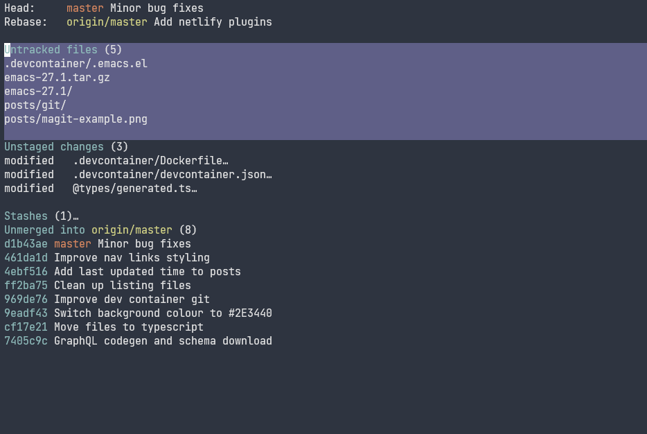
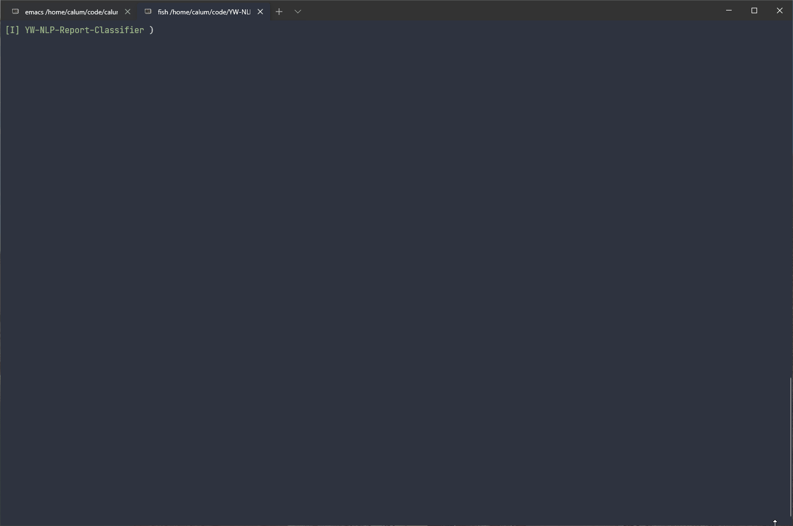

This post will describe the process of setting up a stand-alone Magit terminal app, as well as general tips and advice regarding Magit. Feel free to use the table of contents to skip to the part you're interested in.

# Motivation

I recently switched to using [Magit](https://magit.vc/) for all my Git work. Magit is a text-based interface for Git which was originally developed as an Emacs package. Although there appears to be other ports now for [VSCode](https://marketplace.visualstudio.com/items?itemName=kahole.magit) and [Vim](https://github.com/jreybert/vimagit), I decided to use the original because I wanted the smoothest experience and I don't know how complete those ports are.

I made the decision to switch after spending some time on both ends of the Git user spectrum. For a while I was almost completely reliant on the GUI's offered by my text editors/IDE's, and this did the job until I tried using a "smart" option in PyCharm and a not so smart `git reset --hard` at the wrong moment lost a bunch of my work. After that I read the [Git Book](https://git-scm.com/book/en/v2) and switched to using the command-line. This also worked and I didn't have any large losses of work, the only issue I had was that it was a bit cumbersome to type out the commands and remember them.

After using the CLI for a couple months I remembered Magit from the time I was using Emacs, and when I had some free time over reading break I decided to give it another shot. Magit seemed like the perfect balance between the ease-of-use of the GUI's and the complete control offered by the CLI. Magit offers a visual interface to Git which looks something like this:



This interface shows you the majority of what you want to see, just like a GUI. Also like a GUI, it allows you to take actions on everything you see. However, unlike most GUI's, the actions are triggered with short, mnemonic key bindings, for example `s` to stage the file under the cursor. Further, Magit ensures absolute transparency in the commands it runs. If you ever want to see the commands you're running, just type `$`. This combination of a nice visual interface, fast keybindings, and absolute transparency seemed like just what I needed. (I recommend [this walk through](https://emacsair.me/2017/09/01/magit-walk-through/) for a more thorough (and likely more convincing) introduction to Magit.)

I have always thought Magit was a really beautiful program; the amount of care and thought that has been put into it is apparent every time you use it. The only reason I stopped using it was because I wasn't using Emacs for my development, so it was a pain to start up Emacs just to work with Git. This post describes a Magit-only Emacs setup which should alleviate this pain.

# The Setup

The end product of this setup is a stand-alone Magit app that runs in your terminal. It's fairly straightforward but there were a couple of hiccups I ran into along the way which I'll share my solution to.

I did this on Ubuntu with Windows Subsystem Linux 2, so the steps below may require some tweaks for other operating systems.

Here's a magif of the end goal:



## Step 1: Install Emacs

[See here](https://www.gnu.org/software/emacs/download.html) for download instructions. On Windows the process should be the same as other applications you're used to: download the installer and run it, and on Mac it looks like you can just use Homebrew. I'll go through the install process for Linux because that page doesn't describe it and I wasn't sure how to install it at first.

I'm guessing this install process is the same for most applications on Linux.

1.  Download the tar of the version you want. You can either do it manually or use `curl` (on WSL `curl` is likely easier because you don't have to copy the file over from Windows):

    ```shell
    # (For emacs 27.1)
    curl -O http://mirror.sergal.org/gnu/emacs/emacs-27.1.tar.gz
    ```

2.  De-tar it:

    ```shell
    # These are the arguments for 'tar.gz' files
    tar -zxvf emacs-27.1.tar.gz
    ```

3.  Run the installation processes:

    ```shell
    cd emacs-27.1
    ./configure
    make
    ```

4.  If you want to add Emacs as a binary that you can run:

    ```shell
    # I believe this puts Emacs in one of your bin folders
    sudo make install
    ```

5.  Finally you can delete the downloaded stuff:

    ```shell
    cd ..
    rm emacs-27.1.tar.gz
    rm -rf emacs-27.1
    ```

Now you should be able to run Emacs with the command `emacs-27.1`.

## Step 2: Setup Stand-alone Magit Command

Now we will set things up so that we can run Magit (and just Magit) with the command `magit`. At this point if you don't plan on using Emacs for anything but Magit you can just skip to the next section.

For me though, I like to use Emacs for other things which require a whole bunch of plugins that really slow down start-up. I don't need these plugins to run Magit though, so we're going to use a separate Emacs home directory with only the configuration and plugins required for Magit.

To do this we're going to use the following command to start Emacs:

```shell
HOME=~/magit/ emacs-27.1 --eval "(magit-status)"
```

Emacs creates its configuration in the folder specified by the `HOME` environment variable, so our configuration will be in `~/magit`. Then the `eval` part just tells Emacs to start Magit as soon as it starts. These two things give us the stand-alone Magit feel: our configuration and plugins for Magit are in `~/magit` and are entirely separate from the usual Emacs, and Magit starts right away instead of going to the Emacs home screen.

At this point you'll want to add this as a command you can run easily in your shell. I use `fish` so for me that looks like adding a `magit.fish` file in `~/.config/fish/functions/` with the following contents:

```shell
function magit --description 'Start Magit'
  HOME=~/magit/ emacs-27.1 --eval "(magit-status)" $argv
end
```

I trust that you know how to do this kind of thing on whatever shell you use ;).

Lastly, you'll probably want to create a link to your `.gitconfig` in the `~/magit` folder so that Magit uses your configuration. You can do this with:

```shell
ln -s ~/.gitconfig ~/magit/.gitconfig
```

This will create a soft link, so any changes you make to `~/.gitconfig` will be reflected in `~/magit/.gitconfig`.

Now I can start Magit in any folder with just `magit`!

## Step 3: Configuring Emacs for Magit

Now we install and configure Magit. We can pretty much just follow the [official install instructions](https://magit.vc/manual/magit/Installing-from-Melpa.html#Installing-from-Melpa), but if you followed the instructions in the last step we need to put our config file at `~/magit/.emacs.d/init.el` instead of `~/.emacs.d/init.el`. From here on I'll assume we're picking up from the last step.

So first we add the following to `~/magit/.emacs.d/init.el` (create it if necessary):

```elisp
(require 'package)
(add-to-list 'package-archives '("melpa" . "http://melpa.org/packages/"))
```

Then start Emacs with `magit`, type `M-x package-refresh-contents RET` (Alt-x followed by the command followed by the return key), `M-x package-install RET magit RET`, and this should install Magit. Now if we quit out of Emacs with `C-x C-c` (Ctrl-x Ctrl-c) and start it again, Magit should start up! (It'll be more exciting if you're in a Git repository when you call `magit`)

I also made a few more customizations in my `init.el` to make things nicer:

```elisp

;; Gets rid of the various unnecessary bars
(tool-bar-mode -1)
(menu-bar-mode -1)
(toggle-scroll-bar -1)

;; Split windows vertically, my preference for the various Magit windows
(setq split-width-threshold 0)
(setq split-height-threshold nil)

(require 'package
(add-to-list 'package-archives '("melpa" . "http://melpa.org/packages/"))

;; Vim keybindings for Emacs, can be installed in the same way as Magit
(require 'evil)
(evil-mode 1)
;; Vim keybindings for Magit, can be installed in the same way as Magit
(require 'evil-magit)
;; Opens Magit in full screen
(setq magit-display-buffer-function #'magit-display-buffer-fullframe-status-v1)

;; highlight-start
;; This part configure Magit to use the Windows Git executable if the opened
;; folder is on Windows. This is useful for avoiding a whole bunch of line
;; ending changes.
(defun windows-path (path)
"Returns WSL path converted to Windows path"
    (interactive)
    (string-trim
     (with-output-to-string
       (call-process "wslpath" nil standard-output nil "-w" path))))

(defun is-windows-path (path)
"Returns if path is on Windows as opposed to WSL"
    (interactive)
    (string-prefix-p "C:\\" (windows-path path)))

(defun my-select-magit-git ()
"Uses the Windows git.exe if the git repo is on Windows"
    (interactive)
    (if (is-windows-path (magit-git-dir))
        (setq magit-git-executable "git.exe")))
(add-hook 'magit-mode-hook 'my-select-magit-git)
;; highlight-end
```

You can ignore the highlighted area if you're not on WSL.

Now you should have a nice stand-alone Magit!

# Notes

-   I wouldn't recommend trying to use WSL Magit for Git repositories on Windows, at least not on WSL 2. I tried it for a bit and commands like `commit` and `push` either stalled or just took way too long. Instead just get a separate Emacs for Windows if you have to work with repos on Windows.
-   The [walk-through I recommended](https://emacsair.me/2017/09/01/magit-walk-through/) had a few things that didn't work for me:
    -   The key combination mentioned to save arguments in transient popups didn't work for me, instead what worked was: `C-x C-s` to save default arguments, and `C-x s` for just the current session.
    -   The key combination mentioned to show common commands in transient popups didn't work for me, instead what worked was `C-x t`.
-   A few other alternatives to the stand-alone Magit setup I described are [magit.sh](https://github.com/alphapapa/magit.sh) and [smagit](https://github.com/maio/smagit). I haven't tried them but it looks like they follow a similar path to what I showed but automate more of it.

# Magit Tips

-   You can amend to HEAD by pressing `c a`. While amending and editing the message, press `C-c C-d` to toggle between showing only the changes that are being added to HEAD and all changed that will make it into the amended commit.
-   Marcin Borkowski wrote a few tips [here](http://mbork.pl/2019-05-05_A_few_Magit_tips) which I thought were pretty useful.
-   To cherry-pick commits from another branch onto the current branch, you can use one of the log commands to log the commits from the other branch (e.g. `l o` then the name of the branch), then highlight the range you want to pick, then type `A A` to cherry-pick those onto the current branch. Alternatively you can type `A a` to only apply the changes in the commits but not copy the commits.
