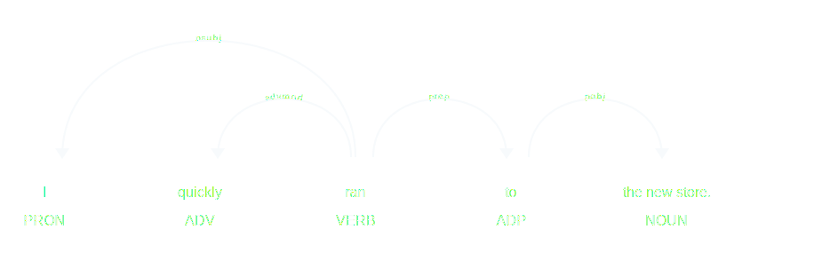
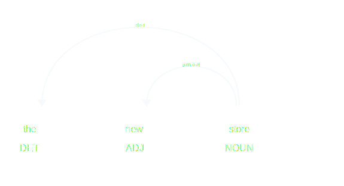

# Problem

I was using [Spacy](https://spacy.io/) at work recently to do some information extraction on text, and I was using [`merge_noun_chunks`](https://spacy.io/api/pipeline-functions#merge_noun_chunks) to simplify finding dependencies between noun phrases and surrounding words. However, in some cases I also wanted to look at the dependencies between words within the noun chunks. I'll use a simple example to demonstrate: say we want to process this sentence:

> I quickly ran to the new store.

The task is to look for mentions of the word "store" and any adjectives attached to the word. Other places in the app rely on merged noun chunks to simplify processing, and the pipeline looks like this:

```python
import en_core_web_lg

nlp = en_core_web_lg.load()
nlp.add_pipe('merge_noun_chunks')
```

We can then process the text and we end up with the following dependency tree:

```python
from spacy.display import render

doc = nlp('I quickly ran to the new store')
render(doc)
```



Due to the noun chunk merging step in the pipeline, "the new store" becomes a single token and there is no way to access the original tokens ("the", "new", and "store") and their dependencies. But we're interested in finding any adjectives describing the word "store", so we need a way to access those original tokens.


# Solution

In order to do this, we can replace `merge_noun_chunks` with our own merging functionality which keeps a reference to the old noun chunk spans in a custom extension:

```python
from spacy.tokens import Token, Doc

Token.set_extension('noun_chunk_span', default=None)

nlp = en_core_web_lg.load()


def copy_doc(doc):
    return Doc.from_docs([doc])


def process_text(text):
    original_doc = nlp(text)
    merged_doc = copy_doc(original_doc)
    with merged_doc.retokenize() as retokenizer:
        for noun_chunk in original_doc.noun_chunks:
            retokenizer.merge(
                merged_doc[noun_chunk.start:noun_chunk.end],
                attrs={
                    '_': {
                        'noun_chunk_span': noun_chunk
                    },
                },
            )

    return merged_doc
```

This works by maintaining two copies of the `Doc`, one with merged noun chunks and one without. The merged `Doc` is the one the app will be working with, and it keeps references to the original noun chunk spans from the original `Doc`. So now when we come across a noun chunk with our keyword, we can look inside the custom extension to easily find any adjectives:

```python
doc = process_text('I quickly ran to the new store')

for token in doc:
    if 'store' in token.text:
        noun_chunk = token._.noun_chunk_span
        if noun_chunk is not None:
            render(noun_chunk)
```



There are a couple things to keep in mind with this approach:

1.  Because this approach requires two copies of the same `Doc` object, if you're working with large amounts of text this may not be the best option. The first place I would look for optimization is to try to find a way to keep just the noun chunk spans without them being attached to the original `Doc`.
2.  It's important to keep in mind that when accessing the noun chunk spans from the custom extension, you are no longer accessing the merged `Doc`.
