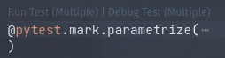

This post will include various tips I've picked up for testing code that uses Spacy.


# Lazy Load the Pipeline

If you're using a testing tool like Pytest which performs test discovery, you'll likely want to prevent the Spacy pipeline from loading until the tests actually run. If you're using a pipeline like `en-core-web-lg` it can take 1-2 seconds to load. For me I was using the Pytest VSCode integration which shows useful Code Lenses above my tests:



In order to do this, every time I modify a test file it reruns Pytest discovery to find where to show the Code Lenses. At first I had `en-core-web-lg` loading at the top level, which meant the pipeline was loaded every time the discovery ran, and this was unnecessarily slow.

So instead I made a function to lazily load the pipeline:

```python
import en_core_web_lg as spacy_pipeline
from spacy.language import Language

_nlp = None


def nlp() -> Language:
    global _nlp
    if _nlp is None:
        _nlp = spacy_pipeline.load()
        # ... other stuff to set up your pipeline ...

    return _nlp
```

Now the pipeline can be loaded only where it's actually needed, and when test discovery runs (which doesn't run the tests), the pipeline won't be loaded.

Lazy loading the pipeline could also be useful for other reasons, for example if you have an app which doesn't use the pipeline every time it runs.
